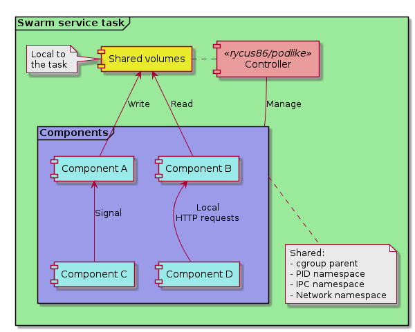

Emulating Kubernetes pods on Docker Swarm mode.

<!--more-->

Running co-located containers with shared resources is not a *k8s* exclusive feature. If your favorite container orchestrator is not *yet* Kubernetes, then this post may be of use for you. Let me introduce a new application, [Podlike](https://github.com/rycus86/podlike), that enables *emulated* pods for Swarm mode with Docker.

## Why pods?

Although most [pods](https://kubernetes.io/docs/concepts/workloads/pods/pod/) on Kubernetes are probably configured to run a single container *logically*, there are very valid [use-cases](https://kubernetes.io/blog/2015/06/the-distributed-system-toolkit-patterns) to tightly couple multiple ones. Some emerging architectural patterns, namely [sidecars](https://docs.microsoft.com/en-us/azure/architecture/patterns/sidecar) and [service mesh](https://istio.io/docs/concepts/what-is-istio/overview.html), also promote this, and may become the norm rather than the exception in the future. It's no surprise, the benefits are undeniable: you can *decorate* your application with deployment, caching, routing, service discovery logic, custom log collection, etc. without having to hard-wire support for these in the app itself.

> This means, your implementation needs to be concerned by the business logic only.

To me, this is huge. You don't have to distract the application code - and yourself - by integrating a caching framework, or by trying to make sure calls to external endpoints are retried properly, with circuit breaking enabled, and so on. Though frameworks, like [Hystrix](https://github.com/Netflix/Hystrix/wiki), make these fairly transparent, it still means you have to add them as a dependency to every single application that works in a similar way, as opposed to letting your infrastructure deal with these communication nuances.

Getting a large fleet of existing, *non-container-native* applications deployed in containers with orchestration, will impose a similar challenge. Do you start changing every app to play nice with your log collector, change from responding signals to accept HTTP requests or messages from a queue as triggers, throw in service discovery pings, and untangle your legacy architecture *(read: spaghetti)* straight-away? Or perhaps you leave them as-is, maybe add *minor* changes, and couple them with another application on the infrastructure level, that is proven to work and can be reused across multiple applications?

## Why Swarm?

Let's assume, you have played around with Docker, built some images, or pulled them from a registry, and ran them locally. Let's also assume, that most people in your team/company/project have done it too. Now you realize, you need to run more of them at the same time for some projects. Your machine has enough resources to do it, so you look into Compose, which operates with very similar settings to the `docker run` command, and it's fairly straightforward to set up the YAML for the applications, starting from the command line arguments. All is well, but eventually, you'll just have too many things to keep on a single machine, too many competing Compose projects, etc. It's time for multi-node orchestration! At this point, your Google search reveals, that you should just go with Kubernetes, that's where everyone is heading. But you just need 3 or 5 nodes to run all your apps, to start with at least, and you're already familiar with Compose.

> Going from Compose to Swarm mode is mostly straightforward, and it is very easy!

If you have time and resources to look into Kubernetes, learn the concepts, figure out the best way *for you* to configure the deployment, and convert your existing scripts/pipelines, then you should definitely do it! There's no denying, the ecosystem and the community around Kubernetes is much bigger, advanced configuration or deployment scenarios are probably implemented and published by someone else, so you can leverage that. But if you don't necessarily need all that complexity, do you need to move away from all the Docker tooling you have already familiarized yourself with? No, you don't. You get a pretty good overall package from Swarm too.

- Overlay networking is given, you don't need to bother selecting a network plugin
- You get a nice, internal DNS resolver to address your services or their tasks
- You get a pretty good scheduler, with constraints and resource limiting logic
- You get replicated secrets and configs
- You get zero-downtime updates and rollbacks
- Swarm services are *close-ish* to the Compose service concept
- Most importantly, a large percentage of the configuration for it will be familiar from Compose, or `docker run`

> In my opinion, the barrier of entry for Swarm is much lower, than it is with k8s.

This is not to say, it's not worth it to invest in Kubernetes, it is, definitely. I'm only suggesting, going through the Docker to Compose to Swarm route is more straightforward, than jumping onto Kubernetes. Check out this excellent thread from [Joe Beda](https://twitter.com/jbeda):

{}
<blockquote class="twitter-tweet" data-lang="en-gb"><p lang="en" dir="ltr">I made the mistake of reading the comments on HN around Kubernetes and there is a common thread around Kubernetes being too complex.  This is something that I&#39;ve been thinking quite a bit about for quite a long time. /1</p>&mdash; Joe Beda (@jbeda) <a href="https://twitter.com/jbeda/status/993978918196531200?ref_src=twsrc%5Etfw">8 May 2018</a></blockquote>
{}

Now, that the motivation for this application is introduced, let's talk about what it is *so far*!

## Introduction

The [Podlike](https://github.com/rycus86/podlike) application itself is written in Go, compiled into a tiny static binary, then packaged as a Docker image, using the `scratch` empty base image. It is intended to be deployed as a Swarm service, although you can run it with Compose or `docker run` too, if you want, for local testing perhaps. Its configuration is driven by the labels on the running container itself, so it lives together with the rest of the stack's description, if you're using stacks.

When scheduled onto a node, Swarm will start a container for the service's task, that will have all the configuration you set when you created, or updated the service, either through `docker service create`, or by defining them in the stack YAML. Let's call this container the __controller__. On startup, it reads its own container labels from the Docker engine, to prepare the configuration for the other containers in the *"pod"*, let's call them __components__.

> Note: To read the labels, and to manage the components, the application needs access to the Docker daemon on the node it's running on. If this is a no-go in your context, then this app is not for you, sorry.

The components can be defined one-by-one in individual labels, or you can have one label, that points to a Compose file in the container. It's important to note, that only container labels are supported, not service labels, because those are not visible on the container, and service labels can only be accessed on Swarm manager nodes.

```yaml
version: '3.5'
services:

  my-app:
    image: rycus86/podlike:0.0.2
    labels:
      # our existing application we're going to enrich with other components
      pod.component.server: |
        image: legacy/app:71.16.5
        environment:
          - IT_IS_TWELVE_FACTOR_THOUGH=no
          - HTTP_PORT=3000
      # copy the logging configuration for the app
      pod.copy.server: >
        /etc/conf/logging.conf:/opt/legacy/app/conf/logs.xml
      # a caching proxy in front of it
      pod.component.cache: |
        image: enterprise/cache:7.0.0
        environment:
          - CACHE_HTTP_PORT=443
          - CACHE_SSL_ON=true
      # copy the cache configuration file in place
      pod.copy.cache: |
        - /etc/conf/cache.conf:/opt/cache/conf.d/default.conf
        - /etc/conf/ssl.cert:/etc/ssl/myapp.cert
        - /etc/conf/ssl.key:/etc/ssl/myapp.key
      # an app for nicely formatted health status, based on checks from the legacy app
      pod.component.healthz: |
        image: enterprise/healthz:1.4.3
        command: >
          check
          --http localhost:3000/db_ready=200
          --http localhost:3000/config_ok=200
          --http localhost:3000/memory_ok=200
          --serve-on 8080
      # support for service discovery
      pod.component.sd: |
        image: oss/service-discovery-agent:2.1.0
        command: >
          --server sd.company.local:1234
          --name my-app
          --health :8080/healthz
      # log collector for the files in the shared log folder
      pod.component.log-collector:
        image: logz/agent:1.3.9
        command: >
          --pattern /var/logs/app/*.log
          --forward tcp://logs.company.local:7701
    # ports published on the service
    ports:
      - 443:443
      - 9001:8080
    # give the service access to the cache config file
    configs:
      - source: log_conf
        target: /etc/conf/logging.conf
      - source: cache_conf
        target: /etc/conf/cache.conf
    # give access to some secrets as well
    secrets:
      - source: ssl-cert
        target: /etc/conf/ssl.cert
      - source: ssl-key
        target: /etc/conf/ssl.key
    volumes:
      # the controller needs access to the host's Docker engine
      - /var/run/docker.sock:/var/run/docker.sock
      # the shared log folder
      - logs:/var/logs/app

configs:
  # logging configuration for the application
  log_conf:
    file: ./logging.xml
  # the cache config file
  cache_conf:
    file: ./cache.conf

secrets:
  # files for SSL certificates as secrets
  ssl-cert:
    file: ./ssl.cert
  ssl-key:
    file: ./ssl-key

volumes:
  # local (per-node) volume for the shared log folder
  logs:
```

Let's take this imaginary stack definition above! The *"pod"* will contain these components:

- `server` for our legacy application
- `cache` for a caching proxy in front of the app
- `healthz` for adding a composite health-check endpoint, that aggregates checks based on some legacy endpoints
- `sd` for a service discovery agent, that registers the app when it is started
- `log-collector` for forwarding logs read from log files on the local, shared volume, to our *cloud native* log aggregator

All 5 components are configured using the `pod.component.<name>` labels. When started, the controller will create the component containers as `<controller-container-name>.podlike.<name>`, so on Swarm the legacy app's container name should become something like `my-app.1.aBcDe.podlike.server`. The service is given access to a couple of Swarm configs and secrets. These will be available within the controller container, and it will copy them to the component containers - after created, but before started -, according to the `pod.copy.<component-name>` labels. The service will also get a local `logs` volume on every node the task is scheduled to, and this volume will be available to all the components, just like `docker run --volumes-from` would make it so.

~~By default, volumes are shared with the all the components, and __this includes__ the Docker engine socket! Volume sharing can be disabled with the `-volumes=false` command line flag.~~

*Edit: the above is no longer true. Since version `0.2.0`, volume sharing is disabled by default, in favor of more security by explicitly defining the volumes we want to share with the components.*

To make the switch over from Compose even easier, you can use a Compose file to describe the components in the service configuration, having the `pod.compose.file` label pointing to a file inside the controller container. You can use the Compose file as-is, the application will ignore any properties it doesn't support, or doesn't make sense for this use case. The example above would look like this, using a file instead of individual labels:

```yaml
version: '3.5'
services:

  my-app:
    image: rycus86/podlike:0.0.2
    labels:
      # the Compose file where each service will become a component
      pod.compose.file: /etc/conf/components.yaml
      # copy the logging configuration for the app
      pod.copy.server: >
        /etc/conf/logging.conf:/opt/legacy/app/conf/logs.xml
      # copy the cache configuration file in place
      pod.copy.cache: |
        /etc/conf/cache.conf: /opt/cache/conf.d/default.conf
        /etc/conf/ssl.cert:   /etc/ssl/myapp.cert
        /etc/conf/ssl.key:    /etc/ssl/myapp.key
    # ports published on the service
    ports:
      - 443:443
      - 9001:8080
    configs:
      # the same as in the previous example, plus
      - source: compose-file
        target: /etc/conf/components.yaml
    secrets:
      # the same as in the previous example
    volumes:
      # the controller needs access to the host's Docker engine
      - /var/run/docker.sock:/var/run/docker.sock
      # the shared log folder
      - logs:/var/logs/app

configs:
  # the same as in the previous example, plus
  compose-file:
    file: ./docker-compose.yml

secrets:
  # the same as in the previous example

volumes:
  # the same as in the previous example
```

It hasn't changed much, compared to the first example, we just hid the definition of the 5 components into a file. Note, that we still need to copy the files into the components at startup.

## Design & implementation

I didn't really have to think hard about the design for the application, it is *simulating* the Kubernetes pod concept, with some limitations and key differences. Let me try to explain how I *think* a pod is working, with my limited understanding, then compare it with the Podlike implementation.

> I'd like to point it out first, that I have __not__ actually used Kubernetes *yet*, so please correct me if I've got any of this below wrong. I'm pretty sure I have, some of it.

As far as I can tell, without having run a single pod on *k8s*, the nodes have an agent, called [kubelet](https://kubernetes.io/docs/concepts/overview/components/#kubelet), running on them, taking tasks [scheduled](https://kubernetes.io/docs/concepts/overview/components/#kube-scheduler) onto them from an [API server](https://kubernetes.io/docs/concepts/overview/components/#kube-apiserver). For new tasks, Kubernetes starts a [pause container](https://www.ianlewis.org/en/almighty-pause-container) as the first *"component"* of the pod, then the others - actually defined by the user - are configured to use the *namespaces* of it. Sharing the network namespace means, the individual containers in the pod can access each other's open ports on `localhost`, on the *loopback* interface, so network traffic doesn't have to leave the host. If you share the *PID namespace*, they can see each other's running processes, and they can send *UNIX signals* to them. Volumes are also configured to the pod as a whole, each container being able to access it, which makes file sharing easy between them. The pod's lifecycle is managed by the agent on the node, and it will take care of stopping the containers as appropriate, plus cleaning up after them. The main process in the `pause` container runs as *PID 1*, and it takes care of reaping the children, if and when they exist, so cleanup should work nicely.

> To find out more about how Kubernetes manages namespaces, cgroups and pods internally, check out [Ian Lewis' blog post](https://www.ianlewis.org/en/what-are-kubernetes-pods-anyway), it's excellent!

So, how do we take this idea, this concept into Docker and Swarm services? The needs, I considered for the design, are:

- Ability to schedule multiple containers to the same node *(affinity)*
- They all need to start and stop together
- Stop and clean them up all, if one fails
- Ability to access each other's open network ports
- Ability to signal each other's processes
- Ability to share files between each other

These translated to the following implementation needs:

- We need *something* that is managed by Swarm
- We need to be able to enter the namespaces of this thing with our containers
- We need this thing to manage the lifecycle of the containers
- We need it to clean up the whole thing, when needed
- We need to share volumes across all the components

The only participant, whose lifecycle Swarm manages for us here, is the task for the service you configure. In our case, this becomes the [Podlike container](https://hub.docker.com/r/rycus86/podlike/). It will have all the resources and settings you defined in the stack YAML, or as arguments to the `docker service create` command. From this point onwards, this application is responsible for *proxying* lifecycle events and actions to the components it starts. So, there is no `pause` container here for now, the controller assumes its responsibilities, plus the additional management of the component containers.

First, it figures out its own container ID by looking at the contents of `/proc/self/cgroup`. It then asks the Docker engine for the details about itself, similar to `docker inspect <container-id>`, but using the API connection to the daemon. Based on the labels it can see, it builds up the list of component definitions for the configuration. The container talks to the local daemon here, which may or may not be a manager in the Swarm cluster, and this is the reason why only container labels are visible and therefore supported, but not service labels.

It then starts the individual components one-by-one, in random order. ~~Compose-style `depends_on` is not supported at the moment, and not sure there is a huge need for it.~~ *Edit: it is supported now, we all have those apps to run that need another container's DNS to be available at startup...* For each of them, it creates a container, but doesn't start it yet. The created container is inspected for its details, to be used later. If there were any file copy labels defined, the corresponding files are copied *from the controller* container to the component's container, still while it's only in created, but not started state. This enables to upload files from configs or secrets to the components, that are made available only to the controller by Swarm.

The container is configured to use the controller's [cgroup](https://en.wikipedia.org/wiki/Cgroups#Namespace_isolation) as the *cgroup* parent (like `--cgroup-parent`), and the *IPC* (`--ipc container:<controller>`) and network *namespaces* (`--network container:<controller>`) are always shared by the controller. The *PID namespace* (`--pid container:<controller>`) is shared by default, but can be disabled with the `-pids=false` flag. Volumes visible on the controller are shared by default as well (`--volumes-from <controller>`), but can also be disabled with `-volumes=false`. The components are started with the auto-remove flag (`--rm`) set, that should *hopefully* help making sure they are cleaned up properly, but at the same time, it can make *post-mortems* a bit difficult.



If the controller is set to always *pull* the images of the components, with the `-pull` flag, this is done before the first create attempt. Otherwise, if the container creation fails because of the missing image, the controller will attempt to *pull* it, and retry creating the container again.

If the component has health-checking enabled, based on the container information read earlier, the controller marks it to consider listening for its `health_status` events. The controller's health, and therefore the task's health, is determined by the aggregated health status of the components. The controller is considered healthy, if all components are either healthy or simply started, if they don't have health-checks defined. The application keeps listening for health events throughout its life. A sidenote: the default health-check of the controller checks the state every 2 seconds, and retries 5 times. If any of the components are expected to become healthy in more than 10 seconds, the health-check configuration on the service needs to take this into account, to avoid Swarm thinking the task has failed to start, as a result of this.

After this initialization phase, the component is finally started. If the application is configured to stream the logs of its components, with the `-logs` flag, this is started at this point for the container, now that it is running. This enables you to choose whether you want to collect logs from the controller only, that will include the logs from all the components, or alternatively, you can set the logging driver individually for each of them, and get [Fluentd](https://www.fluentd.org/) for example to forward them as appropriate.

The controller will then wait for this component to exit, on a new goroutine, and then moves on to set up and start the next one. When any of the components exit, the controller starts the cleanup phase in preparation for exiting. In this phase, each component is stopped and removed forcibly. This is the same sequence, that is done when the controller is asked to exit, by a `SIGINT` or `SIGTERM` signal. When this comes from Swarm, because the task is descheduled for example, the component stop and remove should ideally finish before the stop grace period, otherwise the task will be killed before the cleanup is done. Because the components are started into the controller's *cgroup*, plus it will be the parent with *PID 1*, if *PID* sharing is enabled, the component containers and processes *should* be cleaned up OK, as far as I can tell.

## Dragons!

There are quite a few known limitations, and probably way more unknown ones... Because pods are not a first-class concept in Swarm, some of the lifecycle management described above is not as natural, or robust, as it would be on Kubernetes, I assume. There, the orchestration engine would take care of scheduling all the components as a single unit, here we only have the controller container taken care of.

Sharing the access to the Docker engine can be *very* dangerous, but the controller needs it to do its work. On Kubernetes, the presence of the `pause` container bypasses most of the problems around lifecycle management and resource sharing, and it might get supported on this project in the future, but I thought it would add too much implementation complexity to start with. Swarm shares some resources with the controller, and it shares them with the components - easy. All the cleanup logic also lives in the [tiny pause app](https://github.com/kubernetes/kubernetes/blob/master/build/pause/pause.c), which we need to deal with here in the controller, and I'm not convinced it's bulletproof.

> Note: since version `0.2.0` you don't necessarily have to share the access to the Docker engine, in fact, you're encouraged not to.

Speaking of resource sharing, I haven't done extensive testing on CPU and I/O limits yet, but memory limits seem to work OK, although a bit strangely. By having the component containers inside the controller's *cgroup*, its limits will be applied correctly, so setting it to *500 MB* for example will limit the amount of memory the controller *plus* all the components can use in total, to *500 MB*. If you check the maximum allowed memory on a component though, without explicit limit set on it, it shows as the maximum amount the Docker engine sees - this could trip up some metrics here and there. Memory reservation would also be awkward to set on the components. Swarm considers the reservations, *that it knows about*, for scheduling, so it could think a new task would still fit on a node just fine, then one of the components would just reserve a huge amount when created.

Volume sharing works OK, and it currently relies on `--volumes-from` to pass the volume access from the controller to the components. ~~As-is, it gives access to __all__ volumes, including the Docker API socket, if you use it that way.~ The components are then free to do anything they want with this, like starting more containers, running privileged ones, etc. Suggestions would be very-very welcome to mitigate this potential problem!~~ *Edit: resolved now, see above.*

One of the nicest things in Swarm, in my opinion, is the ability to store configs and secrets, and share them with services. It works beautifully for the container started for a task, but the component containers started by that don't have an easy way of getting a hold of them. The controller works around this by copying the files that were shared with it, on demand, after creating, but before starting the containers.

## Help!

If you didn't get discouraged by the above, and you'd like to give this a go, great! I would love to hear some feedback on what is good and bad about this for you, what potential use you can think of for it if any, and ideas on how to make the application better, more robust and more secure. It would be great, if you could open issues [on GitHub](https://github.com/rycus86/podlike/issues) for the problems you encounter, and any suggestions you have to improve the project. And it would be awesome, if you could open PRs for anything you're missing, or know how to fix, documentation and spelling fixes included. :)

On my end, I'll follow up with some concrete examples on how I think this can be useful, and explain them. For now, you can have a look at simple *(read: dumb)* [examples](https://github.com/rycus86/podlike#use-cases) on GitHub, which all have their own short README, a description on how to start it locally, and a link to the [Docker Playground](https://labs.play-with-docker.com/), that starts up the stack automatically, wherever I was able to do so. Check them out as a starting point, if you're interested! And again, I would love to hear your use-case examples!

Thank you!

> Update: the [new post with examples](https://blog.viktoradam.net/2018/05/24/podlike-example-use-cases/) is now up!
