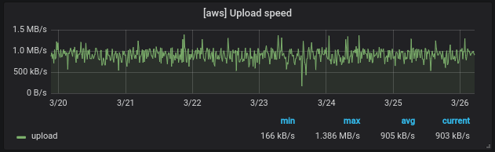
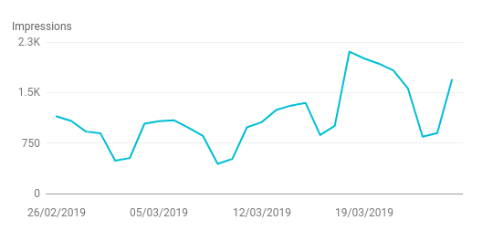

Migrating this blog from a self-hosted Ghost instance to a new CDN that also builds your site &ndash; for free.

<!--more-->

In my [last blog post](https://blog.viktoradam.net/2018/08/30/moving-home/), I wrote about migrating some of my self-hosted apps to [AWS free tier](https://aws.amazon.com/free/) services as I was getting ready to move from the UK to Australia. I had some time now to get things in order, so I could start preparing for when the free tier expires.

## Moving from AWS

AWS is *pretty great*. I think, if the free [EC2 instance](https://aws.amazon.com/ec2/) wouldn't expire, I would probably have left my things running on it for another little while. I have a [Ghost](https://ghost.org/) blog engine running there, a [Prometheus](https://prometheus.io/) and a [Grafana](https://grafana.com/) instance for monitoring, plus a few hand-made services to pull my [GitHub stats](https://github.com/rycus86/github-prometheus-exporter) and [watch for new releases](https://github.com/rycus86/release-watcher). All in all, happily ticking away with *300 MB* memory left and less than *25%* of the disk space in use. After the free tier ends, this would cost about $10 a month, which is not bad, it's just $10 more than I'm willing to pay for it at the moment.

At first, I thought I just move stuff back onto my own servers and host them there, like I did back in the UK. I had a few [Raspberry Pi](https://www.raspberrypi.org/) devices set up and started a couple of containers on them to test the connection. This did not go so well...

> As it turns out, Australian home internet is not at the same level of speed yet as it was in the UK.

I mean, it's OK for streaming *Netflix* and browsing the web and such, not so much for serving content to the internet. Speed tests came back a bit low, so I thought I'll try and measure it for a few days, see if it has better days and worse.



This dashboard shows a [small Python app](https://github.com/rycus86/speedcheck) measuring the upload speed from *Sydney, Australia* to the EC2 instance running somewhere in `us-west-1`. You can see that it averages around *900 kB/s*, which &ndash; again &ndash; is not so bad for a home internet, but it can cost precious milliseconds for uncached requests. It was time to look for alternatives that I had my eyes on for a while now.

## Netlify

I wanted to give [Netlify](https://www.netlify.com/) a try ever since I've heard about them from the amazing [@jessfraz](https://github.com/jessfraz):

{} 
<blockquote class="twitter-tweet" data-lang="en"><p lang="en" dir="ltr">moved my blog to <a href="https://twitter.com/Netlify?ref_src=twsrc%5Etfw">@Netlify</a> in literally 3 minutes, so now <a href="https://twitter.com/calavera?ref_src=twsrc%5Etfw">@calavera</a> has to worry about it now &amp; not me... so this makes me <a href="https://twitter.com/hashtag/serverless?src=hash&amp;ref_src=twsrc%5Etfw">#serverless</a> right?</p>&mdash; jessie frazelle 👩🏼‍🚀 (@jessfraz) <a href="https://twitter.com/jessfraz/status/738658433172283394?ref_src=twsrc%5Etfw">June 3, 2016</a></blockquote>
{}

OK, that sounds really good, but what is this all about? As I quickly learned, it's basically a [CDN](https://en.wikipedia.org/wiki/Content_delivery_network) that can also generate your static site. *Or so I thought...* It turns out, Netlify [Application Delivery Network](https://www.netlify.com/features/adn/) is so much more than this, and it is just plain awesome! As they put it on their site:

> Distributed just like a CDN, but with advanced functionality for publishing entire sites and applications. Automate builds to prerender content and deploy worldwide to every major cloud provider—including staging, rollbacks, and even A/B testing.


And *advanced functionality* it has, wow! And for __free__! You can connect it to your site in a Git repository, mine is [on GitHub](https://github.com/rycus86/blog.viktoradam.net), then you place a [netlify.toml file](https://github.com/rycus86/blog.viktoradam.net/blob/master/netlify.toml) in it, and you're pretty much done. On every push, Netlify will run the build on your repository, then upload the folder you choose to their *ADN*. From that moment, you can see your up-to-date site, no invalidation or cache expiry in play.

> I thought this must be black magic, so I looked into how it's done. The trick is that you get content your browser hasn't seen yet with a proper `ETag` and `Cache-Control: public, max-age=0, must-revalidate` headers. Next time you request the same resource and it hasn't changed, you just get a [HTTP 304 Not Modified](https://http.cat/304) response, and your browser will load the content from its local cache.

This is a pretty good idea, and it gives very good performance since most requests will result in responses with *0 bytes* body and only a couple of headers. Of course, it's all on HTTP/2, so it's fine to have lots of these super small requests. *Amazing!*

Going back to features, you can have automatic branch deploys on a subdomain different to your main one, so you can easily preview and iterate on the changes. This includes content as well as theme and other settings, and also works for pull requests. You can have [redirects](https://github.com/rycus86/blog.viktoradam.net/blob/master/static/_redirects), forms, [Lambda functions](https://aws.amazon.com/lambda/) and more, check out all the features on the [Netlify site](https://www.netlify.com/features/)!

Wait, there's more! You can also choose to have an open-source [CMS](https://en.wikipedia.org/wiki/Content_management_system) on top of your static site! *Mind blown!* [Netlify CMS](https://www.netlifycms.org/) is an [open-source](https://github.com/netlify/netlify-cms) content management system implemented as a [single page application](https://en.wikipedia.org/wiki/Single-page_application), so its setup is basically adding a [single HTML file](https://github.com/rycus86/blog.viktoradam.net/blob/master/static/admin/index.html) plus a [config YAML file](https://github.com/rycus86/blog.viktoradam.net/blob/master/static/admin/config.yml) for settings, and you're done! There's integration with Netlify, so changes that you make in the CMS UI get committed onto a branch in your Git repository, and they'll show up on a PR, then you'll get the preview site for it automatically. *Just... wow...*

## Hugo

*Erm...* That's great, but my blog runs on [Ghost](https://ghost.org/) and Netlify wants a static site. No problem, Netlify is so awesome, that they have a [whole website](https://www.staticgen.com/) listing all the popular static site generators, so I just had to pick one. Looking at the top few options, there's [Jekyll](http://jekyllrb.com/) that is in Ruby, not so sure about that, then also a few JavaScript ones with React, which I don't know, but then there's one that stood out, and I have even heard about it before.

[Hugo](https://gohugo.io/) was meant for me. It's written in Go &ndash; that I have [newfound love](https://blog.viktoradam.net/2018/04/26/go-explore/) for &ndash; and it's blazing fast with a short learning curve. I've read some of the docs, grabbed the [latest release](https://github.com/gohugoio/hugo/releases), and started experimenting with a [theme that I liked](https://github.com/eueung/hugo-casper-two).

> As a side note, I've just realized that Ghost has a pretty well-thought-out solution for the whole Netlify hosting story: [https://gatsby.ghost.org/about/](https://gatsby.ghost.org/about/)  
> This could have been an option as well, check this out too!

Speaking of themes, I decided to keep the previous [Casper](https://github.com/TryGhost/Casper) theme from Ghost, I only had to adapt it to Hugo. The existing port was a very good starting point, so I mostly just had to bring the ~~hacks~~ changes over that I've done on the original one. All in all, the whole theme setup took a couple of hours only, and it now lives [in the same repo](https://github.com/rycus86/blog.viktoradam.net/tree/master/themes/custom) as the posts. One of the main tasks here was to convert Ghost's [Handlebars](https://handlebarsjs.com/) templating to [Go templates](https://golang.org/pkg/html/template/). They're not too far from each other, but far enough to not being able to automate too much of this.

Next, I had to bring my existing content into the new repository. I had the *Markdown* version of the posts in a [GitHub repo](https://github.com/rycus86/blog-content/tree/master/posts), but as it turns out, they were slightly outdated. No problem, Ghost has a [pretty decent API](https://docs.ghost.org/api/), and I happen to have a Python [client library](https://github.com/rycus86/ghost-client) written to talk to it, which is also available [on PyPI](https://pypi.org/project/ghost-client/). I could use this to iterate over my posts easily, and save the *Markdown* files with the Hugo [front-matter](https://gohugo.io/content-management/front-matter/) added automatically.

```python
from ghost_client import Ghost

if __name__ == '__main__':
    cli = Ghost('https://blog.viktoradam.net', client_id='<cid>', client_secret='<cs>')
    try:
        cli.login('<user>', '<password>')
        
        for idx, post in enumerate(cli.posts.list(
                include=['tags', 'authors'], order='published_at asc', formats=['mobiledoc'], limit='all')):
                
            with open('%03d_%s.md' % (idx+1, post.slug), 'wb') as output:
                def fprint(text):
                    output.write(text.encode('utf-8'))
                    if not text.endswith('\n'):
                        output.write(b'\n')
                        
                title = post.title
                if ':' in title:
                    title = '"%s"' % title
                
                fprint('---')
                fprint('title: %s' % title)
                fprint('date: {published_at}'.format(**post))
                fprint('slug: {slug}'.format(**post))
                fprint('image: {image}'.format(image=post.feature_image))
                fprint('tags:')
                for tag in post.tags:
                    fprint('  - %s' % tag.name)
                fprint('authors:')
                for author in post.authors:
                    fprint('  - %s' % author['slug'])
                
                # ...
                
                fprint('---')
                fprint('')
                fprint(post.markdown)
                
            print('Finished:', post.title)
    finally:
        cli.logout()
```

The final migration script ended up being very different, and then later I had refactored the generated files as well, but this was a pretty good starting point. Hugo is *somewhat* opinionated about [content organization](https://gohugo.io/content-management/organization/), though it's easy to follow and it makes sense.

The image migration was mainly copying the existing files from the Ghost backup into a specific folder, so Hugo can pick them up. There are pretty good [image processing](https://gohugo.io/content-management/image-processing/) options, so initially I used those. These can easily resize your images to a smaller size and lower quality at site generation time, so the final file you serve to visitors is less bytes. By now, I have replaced this with pre-processing the images even before, and only once, with [ImageMagick](https://www.imagemagick.org/)'s `convert` and with [pngquant](https://pngquant.org/) to transform `jpeg` and `png` files respectively.

## SEO optimization

This is a topic that I'm passionate about, mainly because I've spent a few years working closely with SEO teams, and also because __over 75%__ of the visits to my blog come from organic search, mainly Google. Ghost did a very good job at being SEO-friendly with all the [structured metadata](https://developers.google.com/search/docs/guides/intro-structured-data) and [AMP](https://www.ampproject.org/) alternatives built in. In Hugo, I had to port these over as the original template didn't have them. Luckily, I had my existing site to compare against, so that is what I did basically.

You can use all sorts of testing tools to make sure your site is going to be Google / SEO-friendly.

1. [Lighthouse](https://developers.google.com/web/tools/lighthouse/) is integrated into the Developer Tools in Chrome, and it can perform a performance audit, but also highlight SEO problems as well.
2. [PageSpeed Insights](https://developers.google.com/speed/pagespeed/insights/) is similar, also heavy on performance tips.
3. [WebPagetest](https://www.webpagetest.org/) is also performance focused with a huge lot of details and tips (and options).
4. [AMP validation](https://www.ampproject.org/docs/fundamentals/validate) can be enabled in Chrome with a simple `#development=1` added to the end of the URL, then you can see validation errors in the Developer Tools console.
5. [Structured Data Testing tool](https://search.google.com/structured-data/testing-tool/u/0/) can validate the metadata on your pages.
6. A [sitemap validator](https://webmaster.yandex.com/tools/sitemap/) can help you check for issues in your sitemap XML.

There's probably more tools I've used, but can't remember them all. In the end, a big factor to consider as well is total download size and page load time. I spent a bit more time optimizing this on the new site, removing unnecessary JavaScript for example, deferring loading certain elements until they're needed, and optimizing images more aggressively. This seems to have resulted in a positive uptick on the number of impressions in Google, though it may be too early to tell if this was random or related.



## Finally

Before the rollout, I've run a site scrape on my previous Ghost blog, and checked the same URLs on the branch preview on Netlify to make sure nothing is broken. To switch over, I've registered my domain name with Netlify, and changed the DNS record to a `CNAME` pointing to the `.netlify.com` subdomain. Of course, I messed something up with the SSL setup, so I had to roll back, but thanks to [Cloudflare](https://www.cloudflare.com/)'s awesomeness, this downtime was only a few seconds or so. I have now switched the Netlify site over to [Let's Encrypt](https://letsencrypt.org/)'s free certificates &ndash; if you haven't heard about them, check them out, they are really amazing and they're making the world a better place!

If you're getting started with Hugo or Netlify and need help, or perhaps thinking about exercising Ghost's API endpoints, find me with your questions &ndash; happy to help!
