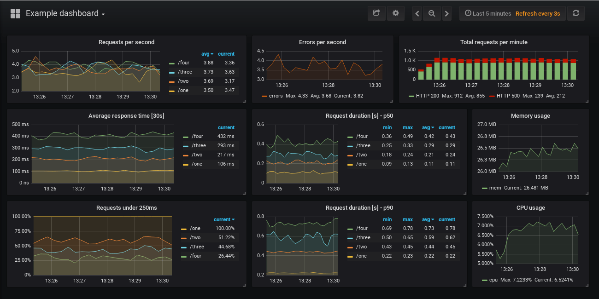

Getting insights into how your Python web services are doing can be easily done with a few lines of extra code.

<!--more-->

To demonstrate [prometheus_flask_exporter](https://github.com/rycus86/prometheus_flask_exporter) with a minimal example:

```python
from flask import Flask
from prometheus_flask_exporter import PrometheusMetrics

app = Flask(__name__)
metrics = PrometheusMetrics(app)

@app.route('/')
def main():
    return 'OK'
```

That's really it to get started! By adding an import and a line to initialize `PrometheusMetrics` you'll get __request duration metrics__ and __request counters__ exposed on the `/metrics` endpoint of the Flask application it's registered on, along with all the default metrics you get from the underlying [Prometheus client library](https://github.com/prometheus/client_python).

You can find an [easy-to-run example](https://github.com/rycus86/prometheus_flask_exporter/tree/master/examples/sample-signals) in the GitHub repo that spins up a [Prometheus](https://prometheus.io) and a [Grafana](https://grafana.com/) instance along with a demo app to generate some metrics, which will look something like this:



You'll also find the list of metrics in the [README](https://github.com/rycus86/prometheus_flask_exporter/tree/master/examples/sample-signals) of the example that are displayed on the dashboard, along with the Prometheus queries which populate the panels.

## Configuration

The library has lots of configuration options, have a look at the [project README](https://github.com/rycus86/prometheus_flask_exporter/blob/master/README.md) for examples of them with a brief explanation.

The basic configuration is as shown at the top. Simply create a `PrometheusMetrics` instance, let's call it `metrics`, then use it do define additional metrics you want collected by decorating functions with:

- `@metrics.counter(..)`
- `@metrics.gauge(..)`
- `@metrics.summary(..)`
- `@metrics.histogram(..)`

The counters count invocations, while the rest of them collect metrics based on the duration of those invocations. You can define labels for each of these, potentially using properties of the request or the response. For example:

```python
from flask import Flask, request
from prometheus_flask_exporter import PrometheusMetrics

app = Flask(__name__)

# group by endpoint rather than path
metrics = PrometheusMetrics(app, group_by='endpoint')

@app.route('/collection/:collection_id/item/:item_id')
@metrics.counter(
    'cnt_collection', 'Number of invocations per collection', labels={
        'collection': lambda: request.view_args['collection_id'],
        'status': lambda resp: resp.status_code
    })
def get_item_from_collection(collection_id, item_id):
    pass
```

In the example above, hitting the endpoint `/collection/10002/item/76` would increment a counter like `cnt_collection{ collection="10002", status="200" }`, plus you would get the default metrics (per-endpoint in this example) from the library, by default:

- `flask_http_request_duration_seconds` - HTTP request duration in seconds for all Flask requests by *method, path and status*
- `flask_http_request_total` - Total number of HTTP requests by *method and status*

There are options to skip tracking certain endpoints, registering more default metrics, or skipping the ones above, or applying the same custom metric to multiple endpoints. Check out the [project README](https://github.com/rycus86/prometheus_flask_exporter/blob/master/README.md) to see what's available.

```python
app = Flask(__name__)
metrics = PrometheusMetrics(app)

@app.route('/')
def main():
    pass  # requests tracked by default

@app.route('/skip')
@metrics.do_not_track()
def skip():
    pass  # default metrics are not collected

# custom metric to be applied to multiple endpoints
common_counter = metrics.counter(
    'by_endpoint_counter', 'Request count by endpoints',
    labels={'endpoint': lambda: request.endpoint}
)

@app.route('/common/one')
@common_counter
def endpoint_one():
    pass  # tracked by the custom and the default metrics

@app.route('/common/two')
@common_counter
def endpoint_two():
    pass  # also tracked by the custom and the default metrics

# register additional default metrics
metrics.register_default(
    metrics.counter(
        'by_path_counter', 'Request count by request paths',
        labels={'path': lambda: request.path}
    )
)
```

The library has some [handy extensions](https://github.com/rycus86/prometheus_flask_exporter#multiprocess-applications) for popular multiprocessing libraries, like [uWSGI](https://uwsgi-docs.readthedocs.io/en/latest/WSGIquickstart.html) and [Gunicorn](https://gunicorn.org/). You can also find [small examples](https://github.com/rycus86/prometheus_flask_exporter/tree/master/examples) for targeted use-cases, including these multiprocessing ones.

## Scraping metrics

As mentioned above, the library exposes a `/metrics` endpoint on the Flask application by default, which can serve as a target for [Prometheus scraping](https://prometheus.io/docs/prometheus/latest/configuration/configuration/#scrape_config).

From the example with the dashboard above, you can point your Prometheus to a Flask app with the default settings with configuration like this:

```yaml
scrape_configs:
  - job_name: 'example'

    dns_sd_configs:
      - names: ['app']
        port: 5000
        type: A
        refresh_interval: 5s
```

See the full example [in the GitHub repository](https://github.com/rycus86/prometheus_flask_exporter/blob/master/examples/sample-signals/prometheus/config.yml). This assumes, that Prometheus can target your Flask application instances on `http://app:5000/metrics`, where the `app` domain name can potentially resolve to multiple IP addresses, like when running in Kubernetes or [Docker Swarm](https://blog.viktoradam.net/2018/01/13/home-lab-part3-swarm-cluster/).

If exposing the metrics endpoint like this is not suitable for you, perhaps because you don't want to allow external access to it, you can easily disable it by passing `path=None` when creating the `PrometheusMetrics` instance.

```python
from flask import Flask, request
from prometheus_flask_exporter import PrometheusMetrics

app = Flask(__name__)
metrics = PrometheusMetrics(app, path=None)

...

metrics.start_http_server(5099)
```

You can then use `start_http_server(port)` to expose this endpoint on a different HTTP port, `5099` in the example above. Alternatively, if you're happy with the endpoint being on the same Flask app, but need to change its path away from `/metrics`, you can either pass in a different URI as the `path` parameter, or use `register_endpoint(..)` to set it up later.

## References

- [rycus86/prometheus_flask_exporter](https://github.com/rycus86/prometheus_flask_exporter) - This Flask exporter for Prometheus
- [prometheus-flask-exporter README](https://github.com/rycus86/prometheus_flask_exporter/blob/master/README.md) - Usage, examples, and configuration options
- [prometheus-flask-exporter examples](https://github.com/rycus86/prometheus_flask_exporter/tree/master/examples) - Examples for setting up Flask app monitoring in different ways
- [prometheus-flask-exporter on PyPI](https://pypi.python.org/pypi/prometheus-flask-exporter) - This project on PyPI
- [prometheus/client_python](https://github.com/prometheus/client_python) - The official Prometheus client library for Python

If you give it a go, open a [GitHub issue](https://github.com/rycus86/prometheus_flask_exporter/issues) or leave a comment here with your feedback and suggestions! Thanks!
